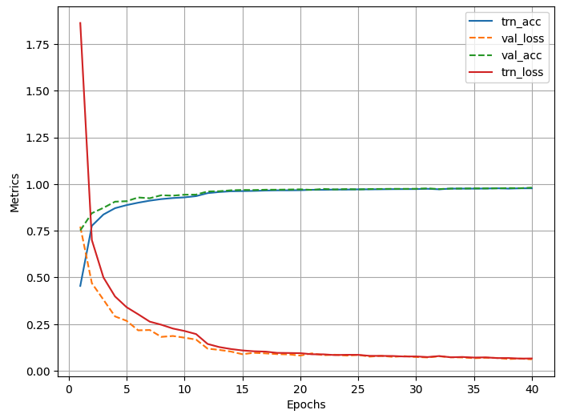

# road_sign_detection
Object detection using a SignClassifier model. 

## Objective
To create a Convolutional Neural Network (CNN) that uses data augmentation and batch normalization to identify road signs in images. 

## Data
For this project, the German Traffic Sign Recognition Benchmark (GTSRB) will be utilized. This dataset includes 43 classes of traffic signs which are split into 39,209 training images and 12,630 test images. Each image has varying lighting conditions and rich backgrounds. The full datasets can be found at https://benchmark.ini.rub.de/gtsrb_dataset.html.

## Packages/Libraries Used
PyTorch
OpenCV
Pandas
MatplotLib
Numpy

## Model Accuracy
The model created had a high accuracy score and minimal overfitting. The training and validation loss and actual scores arevisualized.

